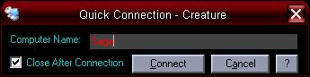

## Quick Connections

### Description

This little program I designed allows you Remotely Connect to any other computer on your network, if the computer you want to connect to has Remote Desktops enabled that is. It uses the Shell command to access the mstsc.exe program. It also inserts the computer name that you wish to connect to and if it's a valid connection you will be remotely connected to that computer.

If you're like me, this comes in handy. It quick and simple and not only that but if you have several computers networked you may not have the same programs loaded on every computer. Just an easy way to run programs on you computer from other computers. I hope you enjoy it.
 
### More Info
 

             |
---                |---
**Submitted On**   |2005-07-14 00:40:26
**By**             |[CelticFox](https://github.com/Planet-Source-Code/PSCIndex/blob/master/ByAuthor/celticfox.md)
**Level**          |Beginner
**User Rating**    |5.0 (10 globes from 2 users)
**Compatibility**  |VB 6\.0
**Category**       |[Miscellaneous](https://github.com/Planet-Source-Code/PSCIndex/blob/master/ByCategory/miscellaneous__1-1.md)
**World**          |[Visual Basic](https://github.com/Planet-Source-Code/PSCIndex/blob/master/ByWorld/visual-basic.md)
**Archive File**   |[Quick\_Conn1913087142005\.zip](https://github.com/Planet-Source-Code/celticfox-quick-connections__1-61691/archive/master.zip)

